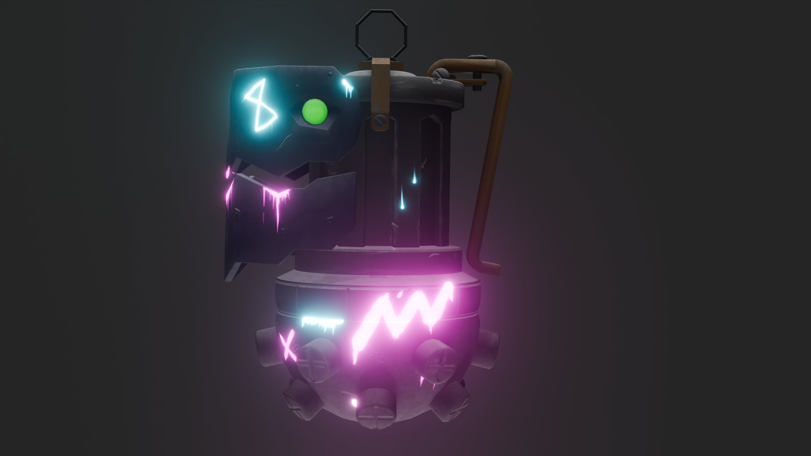

Описание проекта
Этот проект представляет собой 3D-модель гранаты Джинкс, созданную в Blender. Модель включает:

UV-развертку для точного наложения текстур.
Использование материалов с эффектом свечения (эмиссия).
Детализированную геометрию с впадинами, повреждениями и эффектами загрязнения для создания реалистичного вида.
Ноды для текстурирования и настройки материалов.
Особенности модели
UV-развертка:

Для всех частей гранаты была выполнена UV-развертка, что позволило точно наложить текстуры и детали.
Развертка оптимизирована для текстурирования вручную.
Текстурирование:

Использованы яркие, контрастные цвета, соответствующие стилю Джинкс.
Добавлены элементы с эффектом эмиссии (светящиеся детали), чтобы выделить ключевые элементы гранаты.
Моделирование повреждений и впадин:

Для создания впадин и разрушений использовались инструменты скульптинга в Blender.
Добавлены неровности, царапины и повреждения для придания гранате "использованного" вида.
Имитирование загрязнений:

Нанесение небольших пятен грязи и потертостей выполнено кистями (Paint Tool) в текстурировании.
Использованы текстуры с альфа-каналом для дополнительных эффектов.
Glow-эффекты (свечение):

Для некоторых частей гранаты, таких как символы и глаза, использован нод Emission.
Настроен эффект свечения в композитинге для более яркого результата.
Дополнительные ноды:

Использованы ноды для управления отражением, текстурой и свечением.
Инструкция по открытию проекта
Убедитесь, что у вас установлена версия Blender 4.2.3 или выше.
Откройте файл JinxGrenade.blend.
Включите режим Rendered View в правом верхнем углу окна 3D-вида, чтобы увидеть финальный результат с материалами и светом.
Использование проекта
Вы можете использовать эту модель в своих проектах, дорабатывая и адаптируя её под свои нужды.
Разрешается добавлять новые текстуры, менять материалы и изменять геометрию.
Если вы используете модель в своих целях, пожалуйста, укажите автора как источник вдохновения.

# Скриншот гранаты

Лицензия
Проект распространяется под лицензией MIT. Вы можете свободно использовать, изменять и распространять модель, но не забывайте указывать автора при публикации.

